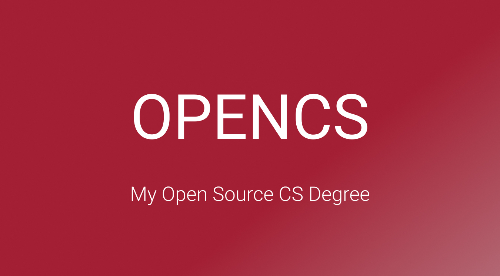

  

<h3 align="center"> Open Source Computer Science Degree </h3>
<h4><i>adapted from <a href="https://github.com/stefanluiken/my-open-source-cs">Stefan Luiken's</a>open source CS curricukum</i></h4>

# Content

- [Summary](#summary)
- [Program](#program)

# Summary

OPENCS is an open source computer science curriculum adapted from [Stefan Luiken's open source CS program](https://github.com/stefanluiken/my-open-source-cs) with all credits to him for personally crafting the curriculum. This program is designed according to the degree requirements of undergraduate computer science majors from top universities. All courses included in this program, originate from the world's top educational institutions in the field of computer science, such as Harvard and University of Helsinki.

I decided to merge my ongoing learning with this curriculum so as to be able to track my learning and also to structure it appropiately. For context, in the previous 2 years, I had predominantly learnt Python and JavaScript. Before undertaking this OPENCS, I had also enrolled in a local diploma program in web and programming to solidify my application on Python and JavaScript (you can find my motivations [here](https://danialfaizsal.com/project-300-2022-mastery-based-learning/)).

The curriculum is designed as follows:
- *Intro CS*: giving a basic but broad overview of the computer science spectrum.
- *Core CS*: classes that all computer science majors would require to take.
- *Specialization CS*: a specialization in software engineering.

# Program

**Program version**: `1.3.0_madifz` (I've added a `_madifz` suffix to differentiate from the original)

- [Basics CS](#basics-cs)
  - [Introduction to Computer Science](#introduction-to-computer-science)
  - [Introduction to Programming](#introduction-to-programming)
- [Core CS](#core-cs)
  - [Core Programming](#core-programming)
  - [Core Systems and Security](#core-systems-and-security)
  - [Core Theory](#core-theory)
  - [Databases and Core Applications](#databases-and-core-applications)
  - [Core Additional Readings](#core-additional-readings)
- [Specialization CS](#specialization-cs)
  - [Software Engineering](#software-engineering)
  - [Web and App Development](#web-and-app-development)
---

## Basics CS

### Introduction to Computer Science

**Topics covered**:
`basic computer science`
`basic programming`
`basic data structures and algorithms`

Progress | Course(s) | University | Duration | Effort
:-- | :--: | :--: | :--: | :--:
 In Progress | [CS50's Introduction to Computer Science](https://www.edx.org/course/cs50s-introduction-to-computer-science) | Harvard University | 12 weeks | 20 hours/week 

### Introduction to Programming

**Topics covered**:
`Java`
`object-oriented design`

Course(s) | Progress | University | Duration | Effort
:-- | :--: | :--: | :--: | :--:
 In Progress | [Head First Java 3rd Edition O'Reilly](https://www.amazon.sg/Head-First-Java-3rd-Brain-Friendly/dp/1491910771) | Literature | 5 weeks | 10 hours/week 
 Assigned | [Java Programming Masterclass covering Java 11 & Java 17](https://www.udemy.com/course/java-the-complete-java-developer-course/) | Udemy | 10 weeks | 8 hours/week 

## Core CS

### Core Programming
**Topics covered**:
`object-oriented design`
`Java`
`IDE`

Course(s) | Progress | University | Duration | Effort
:-- | :--: | :--: | :--: | :--:
 Assigned | [Computing Tools for Computer Science Studies](https://courses.helsinki.fi/en/aytkt50003en/136459952) | University of Helsinki | 1 week | 8-10 hours/week
 Assigned | [Java Programming I](https://java-programming.mooc.fi) | University of Helsinki | 7 weeks | 15-20 hours/week
 Assigned | [Java Programming II](https://java-programming.mooc.fi) | University of Helsinki | 7 weeks | 15-20 hours/week

### Core Systems and Security

**Topics covered**:
`computer architecture`
`memory`
`assembly`
`operating systems`
`secure design`
`network security`

Course(s) | Progress | University | Duration | Effort
:-- | :--: | :--: | :--: | :--:
 Finished ! | [API and Web Service Introduction](https://www.udemy.com/course/api-and-web-service-introduction/) | Udemy | 1 week | 8 hours/week 
 Assigned | [Introduction to Networking](https://www.youtube.com/playlist?list=PLEAYkSg4uSQ2dr0XO_Nwa5OcdEcaaELSG) | Stanford | 4 weeks | 7 hours/week 
 Assigned | [Cyber Security Base: Introduction to Cyber Security](https://cybersecuritybase.mooc.fi/module-1) | University of Helsinki | 2 weeks | 8 hours/week 
 Assigned | [Cyber Security Base: Securing Software](https://cybersecuritybase.mooc.fi/module-2.1) | University of Helsinki | 2 weeks | 8 hours/week
 Assigned | [Build a Modern Computer from First Principles: From Nand to Tetris](https://www.coursera.org/learn/build-a-computer) | Hebrew University of Jerusalem | 6 weeks | 7-13 hours/week 
 
### Core Theory

**Topics covered**:
`sorting and searching`
`O-notation`
`data structures`
`algorithms`

Course(s) | Progress | University | Duration | Effort
:-- | :--: | :--: | :--: | :--:
 Assigned | [Problem Solving with Algorithms and Data Structures Using Python](https://www.amazon.com/Problem-Solving-Algorithms-Structures-Python/dp/1590282574) | Literature | 10 weeks | 12 hours/week  
 Assigned | [Design Patterns Second Edition](https://www.amazon.com/Head-First-Design-Patterns-Object-Oriented/dp/149207800X) | Literature | 4 weeks | 6 hours/week
 Assigned | [AlgoExpert](https://www.algoexpert.io) | AlgoExpert.io | 12 weeks | 10 hours/week
 Assigned | [OCA: Oracle Certified Associate Java SE 8 Programmer](https://www.amazon.nl/OCA-Certified-Associate-Programmer-1Z0-808/dp/1118957407/ref=asc_df_1118957407/?tag=nlshogostdde-21&linkCode=df0&hvadid=430605344342&hvpos=&hvnetw=g&hvrand=17230325203133114130&hvpone=&hvptwo=&hvqmt=&hvdev=c&hvdvcmdl=&hvlocint=&hvlocphy=9065300&hvtargid=pla-394932352707&psc=1) | Literature | 8 weeks | 20 hours/week

### Databases and Core Applications

**Topics covered**:
`databases`
`command line`
`Git`
`DevOps`

Course(s) | Progress | University | Duration | Effort
:-- | :--: | :--: | :--: | :--:
 Assigned | [The Git & Github Bootcamp](https://www.udemy.com/course/git-and-github-bootcamp/) | Udemy | 2 weeks | 10 hours/week
 Finished ! | [The Command Line Bootcamp](https://www.udemy.com/course/the-linux-command-line-bootcamp/) | Udemy | 2 weeks | 10 hours/week
 Assigned | [Docker Mastery: Complete toolset](https://www.udemy.com/course/docker-mastery/) | Udemy | 2 weeks | 10 hours/week 
 Assigned | [Apache Kafka Series: Kafka v2 for beginners](https://www.udemy.com/course/apache-kafka/) | Udemy | 2 weeks | 10 hours/week 
 Assigned | [Databases: Relational Databases and SQL](https://www.edx.org/course/databases-5-sql) | Stanford | 2 weeks | 10 hours/week
 Assigned | [Databases: Advanced Topics in SQL](https://www.edx.org/course/advanced-topics-in-sql) | Stanford | 2 weeks | 10 hours/week
 Assigned | [Databases: Semistructured Data](https://www.edx.org/course/semistructured-data) | Stanford | 2 weeks | 10 hours/week
 Assigned | [SQL and PostgreSQL: The Complete Developer's Guide](https://www.udemy.com/course/sql-and-postgresql/) | Udemy | 2 weeks | 20 hours/week

### Core Additional Readings

**Topics covered**:
`software engineering`
`design patterns`
`best practices`

Course(s) | Progress | University | Duration | Effort
:-- | :--: | :--: | :--: | :--:
 Assigned | [The Pragmatic Programmer](https://www.amazon.com/Pragmatic-Programmer-Anniversary-Journey-Mastery/dp/B0833FBNHV/ref=sr_1_1?crid=3OE7U5XLXOSUA&dchild=1&keywords=pragmatic+programmer&qid=1601587989&s=books&sprefix=pragma%2Cstripbooks-intl-ship%2C230&sr=1-1) | Literature | 4 weeks | 6 hours/week  
 Assigned | [Effective Java Third Edition](https://www.amazon.com/Effective-Java-Joshua-Bloch-ebook/dp/B078H61SCH/ref=sr_1_1?dchild=1&keywords=effective+java&qid=1601845225&s=digital-text&sr=1-1) | Literature | 4 weeks | 6 hours/week
 Assigned | [The Missing README](https://www.amazon.com/Missing-README-Guide-Software-Engineer/dp/1718501838?ref_=ast_slp_dp) | Literature | 3 months | 2 hours/week  
 Assigned | [Software Engineering at Google](https://www.amazon.com/Software-Engineering-Google-Lessons-Programming/dp/1492082791) | Literature | 3 months | 2 hours/week  
 Assigned | [System Design Interview: An insider's guide](https://www.amazon.nl/System-Design-Interview-insiders-guide/dp/B08CMF2CQF/ref=sr_1_2?__mk_nl_NL=ÅMÅŽÕÑ&crid=RWPX24HYZU04&keywords=System+Design+Interview+–+An+insider%27s+guide&qid=1649541893&sprefix=system+design+interview+an+insider%27s+guide%2Caps%2C94&sr=8-2) | Literature | 4 weeks | 6 hours/week
 Assigned | [Clean Code](https://www.amazon.com/Clean-Code-Handbook-Software-Craftsmanship-ebook/dp/B001GSTOAM/ref=sr_1_1?crid=OCOVUA7BKEI0&dchild=1&keywords=clean+code&qid=1601845289&s=digital-text&sprefix=clean+%2Cdigital-text%2C308&sr=1-1) | Literature | 4 weeks | 6 hours/week
 Assigned | [Cracking the Coding Interview](https://www.amazon.com/Cracking-Coding-Interview-Programming-Questions/dp/0984782850/ref=sr_1_1?dchild=1&keywords=Cracking+the+coding+interview%5D&qid=1601415898&s=books&sr=1-1) | Literature | 12 weeks | 20 hours/week  
 Finished (re-reading) | [The Coding Career Handbook](https://www.learninpublic.org/) | Literature | 2 weeks | 2 hours/week  

## Specialization CS

### Software Engineering

**Topics covered**:
`large-scale software architecture and design`
`compilers`
`debugging theory and practice`

Course(s) | Progress | University | Duration | Effort
:-- | :--: | :--: | :--: | :--:
 Assigned | [Software Engineering: Introduction](https://www.edx.org/course/software-engineering-introduction-ubcx-softeng1x) | The University of British Columbia | 6 weeks | 10 hours/week
 Assigned | [Software Debugging](https://www.udacity.com/course/software-debugging--cs259) | Udacity | 8 weeks | 6 hours/week
 Assigned | [Software Testing](https://www.udacity.com/course/software-testing--cs258) | Udacity | 4 weeks | 6 hours/week
 Assigned | [Software Architecture & Design](https://www.udacity.com/course/software-architecture-design--ud821) | Georgia Tech | 8 weeks | 12 hours/week
 Assigned | [Software Construction in Java](https://openlearninglibrary.mit.edu/courses/course-v1:MITx+6.005.1x+3T2016/about) | MIT | 10 weeks | 15 hours/week
 Assigned | [Advanced Software Construction in Java](https://openlearninglibrary.mit.edu/courses/course-v1:MITx+6.005.2x+1T2017/about) | MIT | 15 weeks | 10 hours/week

### App and Web Development

**Topics covered**:
`Android development`
`Java`
`Gradle`
`Fullstack web development`
`JavaScript`
`React`

Course(s) | Progress | University | Duration | Effort
:-- | :--: | :--: | :--: | :--:
 In Progress (Semester 1) | [Diploma (Conversion) in Web and Programming](https://www.sp.edu.sg/pace/courses/course-type/part-time-and-post-diplomas/diploma-(conversion)-in-web-and-programming) | Singapore Polytechnic | 52 weeks | 8 hours/week
 Assigned | [CSS for JavaScript Developers](https://courses.joshwcomeau.com/css-for-js) | Josh Comeau Courses | 12 weeks | 10 hours/week
 Assigned | [Bootcamp: Full stack open 2022](https://fullstackopen.com/en/) | University of Helsinki | 12 weeks | 10 hours/week
 Assigned | [Nanodegree: Android Basics](https://www.udacity.com/course/android-basics-nanodegree-by-google--nd803) | Udacity | 12 weeks | 10 hours/week